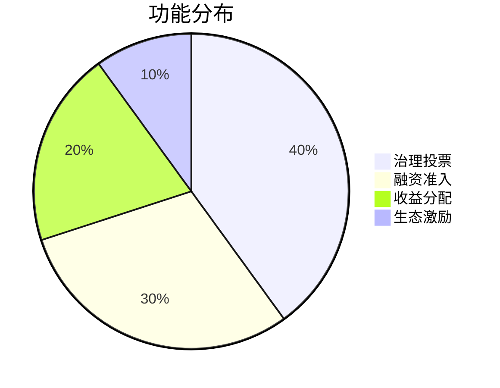

# DAO Maker是什么？区块链项目孵化平台深度解析

## 一、平台核心定位
DAO Maker是专注区块链初创项目的综合性孵化平台，通过创新的"DAO+VC"模式为早期项目提供从融资到运营的全周期支持。作为Web3.0领域的专业基础设施，其核心价值体现在三大维度：
1. **合规融资框架**：构建符合全球监管要求的众筹体系
2. **生态赋能体系**：整合资源、技术、市场推广等多维支持
3. **社区治理机制**：基于DAO代币的去中心化决策系统

👉 [获取区块链投资必备工具](https://bit.ly/okx_welcome)

## 二、核心功能解析
### 1. 代币发行与融资服务
平台提供多层级参与机制：
- **DAO Pad平台**：采用动态质押阈值制度，用户需锁定至少50,000 DAO代币获取白名单资格
- **智能分配系统**：根据质押量级自动匹配项目额度，确保中小投资者参与机会
- **合规审查流程**：建立KYC/AML双重验证体系，已通过ISO/IEC 27001认证

### 2. 创新金融产品：Venture Bonds
该产品通过DeFi与CeFi融合创造新型收益模型：
| 功能模块 | 运作机制 | 收益结构 |
|---------|----------|----------|
| 债券认购 | 用户购买初创企业发行的债券 | 固定年化收益3-5% |
| 资金池运作 | 部署至AA级DeFi协议（如Aave） | 浮动收益（当前APY约12.7%） |
| 收益再投资 | 企业获得协议收益用于开发 | 形成正向增长循环 |

👉 [体验创新金融产品](https://bit.ly/okx_welcome)

### 3. 社区激励体系
通过多维激励构建活跃生态：
- **Social Mining计划**：日均奖励池达50,000 DAO代币
- **流动性挖矿**：支持ETH/DAOM、DAOM/USDT等交易对
- **贡献度评级**：根据参与频次解锁专属空投、NFT奖励等权益

## 三、代币经济模型
DAO代币作为平台治理核心，具备多重价值捕获能力：

质押经济数据（截至2025Q1）：
- 年化收益率：8.2%-15.6%（动态调整）
- 总质押量：超2.3亿DAOM
- 锁仓期限：7日/30日/90日可选

## 四、安全存储方案
### 推荐存储方式对比表：
| 钱包类型 | 安全评级 | 便捷性 | 适用场景 |
|---------|----------|--------|----------|
| 硬件钱包 | ★★★★★ | ★★☆ | 大额长期持有 |
| 手机钱包 | ★★★★☆ | ★★★★ | 日常交易 |
| 网页钱包 | ★★★☆ | ★★★★☆ | 小额支付 |

操作指南：
1. 下载Trust Wallet时注意验证开发者信息（官网地址：trustwallet.com）
2. 设置2FA验证时建议绑定生物识别
3. 导入钱包时务必在离线环境下记录助记词

👉 [获取安全钱包指南](https://bit.ly/okx_welcome)

## 五、投资参与路径
### 四步完成投资流程：
1. **账户准备**
   - 注册Binance等合规交易所
   - 完成L2身份认证（建议上传护照信息）
2. **资金配置**
   - 法币通道：支持VISA/MasterCard即时入金
   - 加密货币：推荐持有ETH作为基础资金
3. **参与方式选择**
   - 普通认购：通过DAO Pad平台参与IDO
   - 债券投资：在Venture Bonds板块筛选项目
4. **收益管理**
   - 自动复利：开启质押收益自动再投资
   - 多币种组合：建议配置50%ETH+30%DAOM+20%稳定币

## 六、FAQ高频问题解答
### Q1：DAO Maker与传统风投的区别？
A：核心差异体现在准入门槛和透明度。传统VC单笔投资门槛通常在5万美元以上，而DAO Maker允许最低100美元参与。项目方需通过公开路演接受社区质询，所有投资条款链上可查。

### Q2：如何评估项目风险？
A：平台采用三级风险评估体系：
1. 基础层：代码审计（必经CertiK等机构）
2. 项目层：团队背景调查（要求披露核心成员身份）
3. 市场层：竞争格局分析（需提交SWOT报告）

### Q3：收益如何兑现？
A：提供多通道退出机制：
- 二级市场：支持Uniswap等AMM协议即时交易
- 场外交易：针对大额订单提供OTC柜台服务
- 代币回购：平台每季度进行销毁性回购

### Q4：遇到诈骗怎么办？
A：立即执行三步应对：
1. 截图保留证据（交易哈希、对话记录）
2. 通过平台举报通道提交材料
3. 向当地金融监管机构报案（需提供KYC信息）

## 七、行业竞争优势
### 与同类平台对比分析：
| 维度 | DAO Maker | 传统Launchpad | 其他DAO平台 |
|------|-----------|----------------|--------------|
| 合规资质 | 拥有瑞士VQF牌照 | 多数无牌照 | 部分合规 |
| 社区规模 | 200万+活跃用户 | 50万以下 | 100万左右 |
| 成功项目 | 85%存活率（3年） | 60%存活率 | 70%存活率 |
| 收益结构 | 多层收益模型 | 单一代币激励 | 双代币体系 |

## 八、风险提示
投资者需关注以下潜在风险：
1. **监管风险**：各国对DAO组织的法律界定尚不明确
2. **市场风险**：加密货币整体波动可能影响项目估值
3. **技术风险**：智能合约漏洞可能导致资金损失
4. **流动性风险**：部分项目代币可能存在交易深度不足

建议采取分批建仓策略，单项目投资不超过总仓位的5%。定期关注平台发布的项目进度报告（需绑定Discord账号获取）。

👉 [获取专业投资策略](https://bit.ly/okx_welcome)