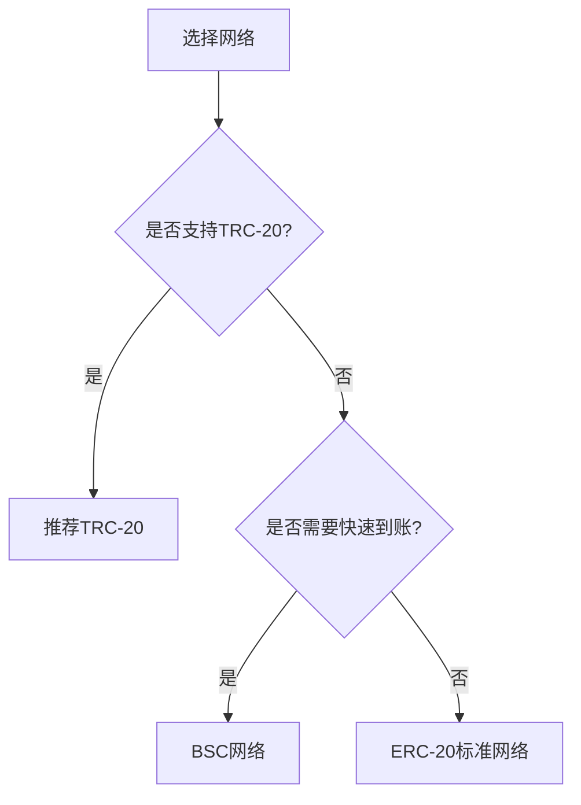

# 币安如何提现USDT？

## 核心操作指南与实用技巧

USDT作为全球应用最广泛的稳定币，其便捷的法币兑换特性使其成为加密货币交易者的首选工具。币安平台凭借其安全稳定的交易环境和完善的提现系统，为用户提供了高效的资金管理方案。本文将系统解析USDT提现全流程，并提供专业级操作建议。

## 核心操作流程

### 一、账户安全准备
👉 [立即升级账户安全等级](https://bit.ly/okx_welcome)
1. 完成KYC身份认证
2. 绑定双重身份验证（2FA）
3. 设置资金密码保护

### 二、进入提现系统
1. 登录币安官网后点击右上角【钱包】
2. 在下拉菜单中选择【提现】选项
3. 在资产列表中筛选USDT币种

### 三、精准填写提现信息

| 提现要素       | 填写规范                          |
|----------------|-----------------------------------|
| 提币地址       | 必须为完整有效的区块链地址        |
| 提现数量       | 需大于平台最低提现限额            |
| 网络选择       | 建议选择TRC-20（手续费更低）      |
| 备注信息       | 按接收方要求填写（如需）          |

### 四、多重验证确认
1. 系统自动校验地址格式
2. 邮箱/手机二次验证
3. 交易记录实时推送提醒

## 关键注意事项

### 网络协议选择指南
- **ERC-20协议**：适用于以太坊生态钱包，平均手续费$0.5-2
- **TRC-20协议**：波场网络支持，手续费低于$0.1
- **BSC协议**：币安智能链专属，确认速度最快

⚠️ 重要提示：确保选择的网络与目标钱包支持协议完全一致

### 常见问题解答

**Q:** 提现手续费是如何计算的？  
**A:** 币安采用动态费率机制，具体比例在提现页面实时显示，通常为0.1%-0.5%

**Q:** 提现后多久能到账？  
**A:** 网络正常情况下：ERC-20约10分钟，TRC-20约3分钟，BSC约1分钟

**Q:** 地址填写错误如何处理？  
**A:** 立即联系客服并提供交易哈希值，专业团队将协助追踪

**Q:** 限额规则是怎样的？  
**A:** 未认证用户单日$50,000等值，VIP用户最高可达$5,000,000等值

**Q:** 如何查询交易状态？  
**A:** 通过【钱包】-【交易记录】查看实时进度，或使用区块链浏览器验证

👉 [获取实时网络拥堵预警](https://bit.ly/okx_welcome)

## 专业操作建议

### 资金管理策略
1. 分批提现降低网络风险
2. 避开交易高峰时段（北京时间20:00-24:00）
3. 定期更新钱包地址防止重复使用

### 安全防护体系
- 启用IP登录提醒
- 绑定硬件安全密钥
- 设置资金变动通知

### 网络选择决策树

👉 [获取最新网络状态监控](https://bit.ly/okx_welcome)

## 风险防控机制

### 典型错误案例
- **地址混淆**：将BTC地址误用于USDT提现（年均损失$12M+）
- **网络错配**：ERC-20与TRC-20混用（资金冻结率超73%）
- **数额误填**：百万级USDT误操作事件年均发生20+起

### 应急处理方案
1. 立即冻结账户
2. 提交完整交易凭证
3. 通过人工客服通道申诉

通过系统化的操作流程和严格的风险控制，用户可以在保障资金安全的前提下，高效完成USDT资产的跨平台转移。建议新用户首次操作时选择小额测试，待确认流程无误后再进行大额资金划转。