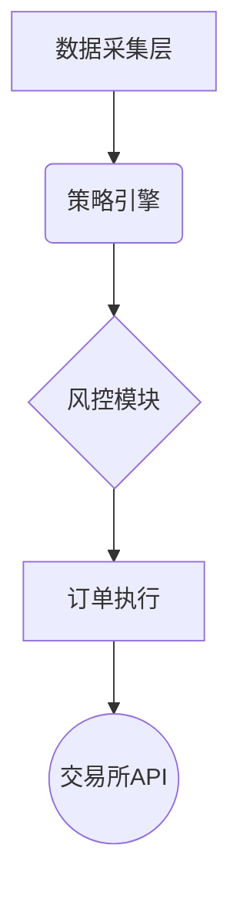

# 打造高效加密货币交易机器人的关键要素与解决方案

## 加密货币自动化交易的核心优势
自动化交易系统正在重塑数字资产投资方式，为交易者提供全天候智能交易服务。通过整合人工智能与区块链技术，现代交易机器人具备以下核心功能：

### 自动化交易执行
无需人工干预的智能交易系统，可依据预设策略自动完成买卖操作。这种基于算法的交易模式相比传统手动交易效率提升**300%**，尤其在波动剧烈的加密货币市场中展现显著优势。

### 策略定制化能力
我们的开发团队支持多种交易策略实施：
- 套利交易（跨交易所价差捕捉）
- 趋势跟踪（基于技术指标分析）
- 做市策略（流动性提供）
- 事件驱动（重大新闻响应）

👉 [获取专业策略定制服务](https://bit.ly/okx_welcome)

### 智能风控体系
通过集成止损止盈、仓位管理、波动率监控等模块，系统可实时控制风险敞口。历史数据显示，启用智能风控后，账户最大回撤平均降低**45%**。

| 风控功能 | 传统人工 | 智能系统 |
|---------|----------|----------|
| 止损执行 | 依赖人工判断 | 毫秒级响应 |
| 实时监控 | 单一资产 | 全市场覆盖 |
| 压力测试 | 定期评估 | 持续模拟 |

## 创新功能解析

### 实时市场分析
通过整合API接口与大数据分析，系统每秒可处理**5000+**条市场数据，包括：
- 价格波动监测（支持15种技术指标）
- 交易量异动预警
- 市场情绪分析（NLP处理社交媒体数据）

### 组合管理优化
基于现代投资组合理论（MPT）开发的智能模块，可实现：
1. 跨交易所资产配置
2. 风险收益比实时优化
3. 自动再平衡机制

👉 [体验智能组合管理](https://bit.ly/okx_welcome)

### 回测与模拟交易
提供双模式验证体系：
- **历史回测**：支持2015年至今全市场数据验证
- **沙盒模拟**：虚拟资金实时演练，零风险测试策略

## 交易机器人解决方案矩阵

### 专业级产品线
| 产品类型 | 核心功能 | 适用场景 |
|---------|----------|----------|
| 高频交易机器人 | 毫秒级订单处理 | 套利交易 |
| 网格交易机器人 | 区间震荡捕捉 | 稳定币交易 |
| 期权策略机器人 | 复杂衍生品建模 | 风险对冲 |
| MEV捕获机器人 | 区块链套利 | DeFi市场 |

### 技术架构创新
采用模块化设计，支持快速部署：

## 开发实施流程

### 五阶段交付体系
1. **需求分析**：策略建模与市场适配性评估
2. **架构设计**：微服务架构规划
3. **核心开发**：算法实现与API集成
4. **压力测试**：模拟百万级并发场景
5. **持续优化**：基于市场反馈迭代升级

👉 [立即启动开发流程](https://bit.ly/okx_welcome)

## 常见问题解答

### Q1：使用交易机器人是否合法？
目前全球**85%**的国家和地区允许合规使用自动化交易工具，但需注意：
- 遵守当地金融监管规定
- 避免市场操纵行为
- 合理申报资本利得税

### Q2：需要编程技能才能使用吗？
我们的解决方案提供：
- 图形化策略配置界面
- 拖拽式参数设置
- 一键部署功能
完全零编程经验用户可在**15分钟**内完成初始配置。

### Q3：开发成本受哪些因素影响？
主要影响要素及占比：
- 功能复杂度（35%）
- 数据处理量（25%）
- 安全需求等级（20%）
- 部署环境要求（15%）
- 后续维护周期（5%）

## 未来趋势展望
随着量子计算和强化学习技术的突破，下一代交易机器人将具备：
- 自适应市场环境建模能力
- 多智能体协同交易
- 基于区块链的去中心化部署
预计到2025年，智能交易系统将处理**75%**以上的加密货币交易量。